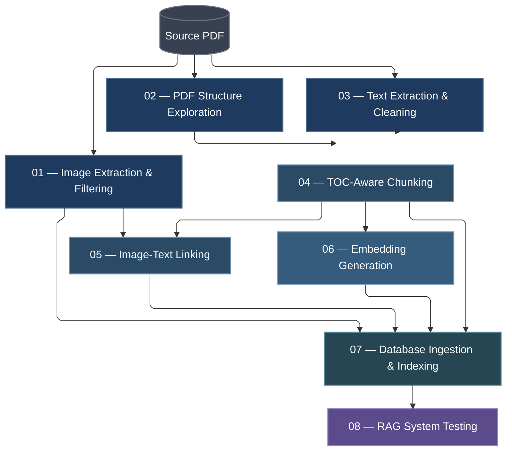

# Intelligent SCADA Assistant — Notebook Pipeline

These notebooks form the end-to-end data-processing pipeline for the **Intelligent SCADA Assistant**. They transform a large SCADA system guide PDF into a structured, retrieval-ready knowledge base powered by PostgreSQL + pgvector.

---

## Pipeline Overview

---

## Notebook Summary

| Step | Notebook | Purpose | Main Output |
|:----:|----------|---------|-------------|
| `01` | Image Extraction and Filtering | Extract all embedded images from the source PDF and filter out noisy or irrelevant artifacts | Image manifest with keep/discard decisions |
| `02` | PDF Structure Exploration | Analyze the document TOC, heading hierarchy, text density, and overall layout structure | Structural metadata and exploration findings |
| `03` | Text Extraction and Cleaning | Extract raw page-level text and remove repeated headers, footers, and mechanical noise | Raw and clean page-text JSON files |
| `04` | TOC-Aware Chunking | Build semantically meaningful chunks following the TOC hierarchy with rich metadata | `text_chunks.json` with full section metadata |
| `05` | Image-Text Linking | Link filtered images to their relevant text chunks based on page overlap | `chunk_image_links.json` |
| `06` | Embedding Generation | Generate dense semantic vector embeddings using `all-mpnet-base-v2` for all chunks | Embedding `.npy` file and metadata JSON |
| `07` | Database Ingestion and Indexing | Ingest all chunks, images, and chunk-image links into PostgreSQL with pgvector indexing | Populated `chunks`, `images`, `chunk_images` tables |
| `08` | RAG System Testing | Validate end-to-end retrieval quality, answer generation, citations, and image retrieval | Full RAG system test results |

---

## Execution Order

This project follows a staged pipeline. Each notebook consumes outputs produced by earlier stages, so they should be executed in order.

**`01` → `02` → `03` → `04` → `05` → `06` → `07` → `08`**

> **Important:** Later notebooks depend on files generated by earlier notebooks. Skipping a stage will result in missing inputs.

---

## Key Design Principles

- **TOC-aware chunking** instead of blind fixed-size splitting — chunks follow document structure
- **Rich metadata** per chunk — section path, TOC level, page references, part indices
- **Image linking as optional visual support** — images are not sent to the LLM, but can be surfaced in a front-end
- **Semantic embeddings** via `sentence-transformers/all-mpnet-base-v2` for meaning-based retrieval
- **PostgreSQL + pgvector** as the production-grade retrieval backend
- **Final RAG validation** ensures the full pipeline delivers accurate, well-cited answers

---

## Data Notice

This repository does not include the original PDF, extracted text, extracted images, embeddings, or any generated data derived from copyrighted technical manuals.

The notebooks are provided to demonstrate the processing pipeline, system architecture, and implementation approach. To run the full pipeline locally, users should provide their own legally obtained technical document and configure the required file paths accordingly.
