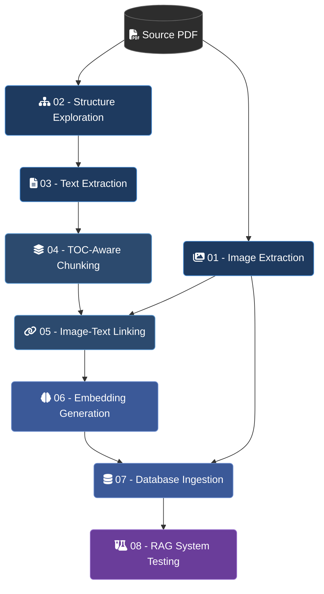

# Intelligent SCADA Assistant — Notebook Pipeline

These notebooks form the end-to-end data-processing pipeline for the **Intelligent SCADA Assistant**. They transform a large SCADA system guide PDF into a structured, retrieval-ready knowledge base powered by PostgreSQL + pgvector.

---

## Pipeline Overview

---

## Notebook Summary

| Notebook | Purpose | Main Output |
|----------|---------|-------------|
| `01` Image Extraction and Filtering | Extract and filter useful images from the PDF | Image manifest with keep/discard decisions |
| `02` PDF Structure Exploration | Analyze TOC, headings, text density, and layout | Structural metadata and findings |
| `03` Text Extraction and Cleaning | Extract raw text, clean headers/footers/noise | Raw and clean page-text JSONs |
| `04` TOC-Aware Chunking | Build chunks following the TOC hierarchy with rich metadata | `text_chunks.json` |
| `05` Image-Text Linking | Link filtered images to chunks via page overlap | `chunk_image_links.json` |
| `06` Embedding Generation | Generate embeddings using `all-mpnet-base-v2` | Embedding `.npy` + metadata JSON |
| `07` Database Ingestion and Indexing | Ingest chunks, images, and links into PostgreSQL + pgvector | Populated `chunks`, `images`, `chunk_images` tables |
| `08` RAG System Testing | Test retrieval, answer generation, citations, and image retrieval | End-to-end RAG test results |

---

## Execution Order

This project follows a staged pipeline. Each notebook consumes outputs produced by earlier stages, so they should be executed in order.

### Pipeline Sequence

**01 → 02 → 03 → 04 → 05 → 06 → 07 → 08**

### Notebooks

| Step | Notebook |
|------|----------|
| 01 | Image Extraction and Filtering |
| 02 | PDF Structure Exploration |
| 03 | Text Extraction and Cleaning |
| 04 | TOC-Aware Chunking |
| 05 | Image-Text Linking |
| 06 | Embedding Generation |
| 07 | Database Ingestion and Indexing |
| 08 | RAG System Testing |

> **Important:** Later notebooks depend on files generated by earlier notebooks.

---

## Key Design Principles

- **TOC-aware chunking** instead of blind fixed-size splitting — chunks follow document structure
- **Rich metadata** per chunk — section path, TOC level, page references, part indices
- **Image linking as optional visual support** — images are not sent to the LLM, but can be surfaced in a front-end
- **Semantic embeddings** via `sentence-transformers/all-mpnet-base-v2` for meaning-based retrieval
- **PostgreSQL + pgvector** as the production-grade retrieval backend
- **Final RAG validation** ensures the full pipeline delivers accurate, well-cited answers

---

## Data Notice

This repository does not include the original PDF, extracted text, extracted images, embeddings, or any generated data derived from copyrighted technical manuals.

The notebooks are provided to demonstrate the processing pipeline, system architecture, and implementation approach. To run the full pipeline locally, users should provide their own legally obtained technical document and configure the required file paths accordingly.

